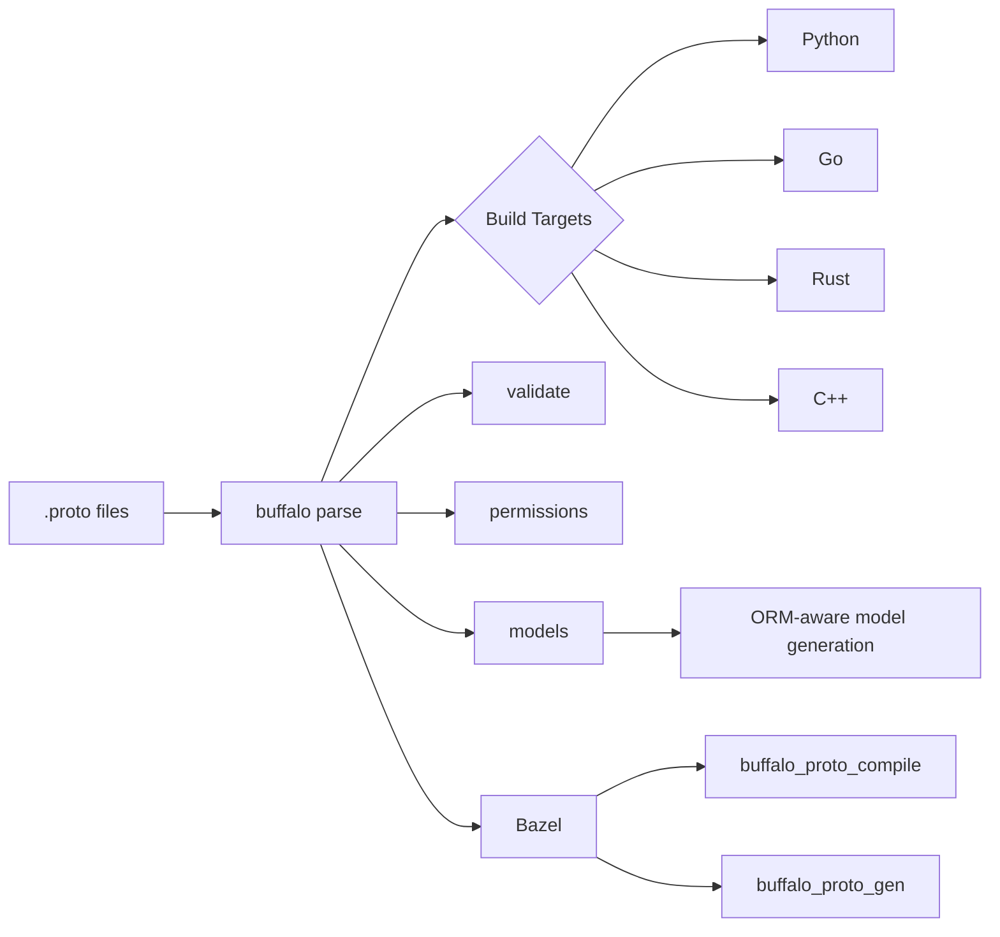
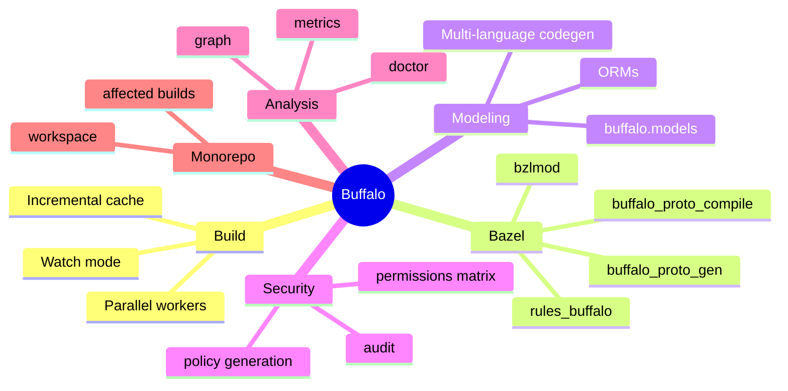

# 🦬 Buffalo — Multi-Language Protobuf/gRPC Build System

<div align="center">

[](LICENSE)
[](https://go.dev/)
[](https://github.com/massonsky/buffalo/releases)
[](https://github.com/massonsky/buffalo)
[](https://github.com/massonsky/buffalo/issues)

**Быстрые инкрементальные сборки protobuf/gRPC для Python, Go, Rust и C++**

</div>

---

## ✨ Почему Buffalo

- ⚡ **Скорость**: кэш, инкрементальные и параллельные сборки
- 🌍 **Мультиязычность**: Python / Go / Rust / C++
- 🏗️ **Bazel-native**: `rules_buffalo` — встраивается в Bazel build graph через bzlmod
- 🧩 **Расширяемость**: плагины, шаблоны, workspace
- 🔐 **Security-first**: permissions audit + matrix
- 📈 **Наблюдаемость**: stats, metrics, dependency graph

---

## 🎬 30-секундный старт

```bash
buffalo init myproject
cd myproject
buffalo build
```

С Bazel:

```bash
buffalo init --bazel myproject
cd myproject
bazel build //:proto_gen
```

Хочешь быстрее в прод? Начни с [Quick Start](docs/readme/QUICK_START.md).

---

## 🗺️ Визуальная схема пайплайна



## 🧠 Карта возможностей



---

## 🏗️ Bazel-интеграция

Buffalo встраивается в Bazel build graph как нативное правило через bzlmod.

```bash
# Инициализация — извлекает rules_buffalo в .buffalo/bazel/rules_buffalo/
buffalo init --bazel
```

Добавь в `MODULE.bazel`:

```python
bazel_dep(name = "rules_buffalo", version = "1.0.0")
local_path_override(
    module_name = "rules_buffalo",
    path = ".buffalo/bazel/rules_buffalo",
)
```

Используй в `BUILD.bazel`:

```python
load("@rules_buffalo//buffalo:defs.bzl", "buffalo_proto_compile")

# Hermetic: bazel build //:proto_gen
buffalo_proto_compile(
    name = "proto_gen",
    srcs = glob(["proto/**/*.proto"]),
    config = "buffalo.yaml",
    languages = ["go", "rust", "python"],
)
```

Для генерации в source tree (dev-workflow):

```bash
bazel run //:buffalo_gen
bazel run //:buffalo_gen -- --verbose
```

Подробнее: [bazel/rules_buffalo/README.md](bazel/rules_buffalo/README.md)

---

## 📚 Читай по разделам (коротко и удобно)

- **Установка** → [docs/readme/INSTALLATION.md](docs/readme/INSTALLATION.md)
- **Быстрый старт** → [docs/readme/QUICK_START.md](docs/readme/QUICK_START.md)
- **CLI шпаргалка** → [docs/readme/CLI_CHEATSHEET.md](docs/readme/CLI_CHEATSHEET.md)
- **Инструменты (`buffalo tools`)** → [docs/readme/TOOLS.md](docs/readme/TOOLS.md)
- **Graph + Workspace** → [docs/readme/GRAPH_AND_WORKSPACE.md](docs/readme/GRAPH_AND_WORKSPACE.md)
- **Permissions/RBAC** → [docs/readme/PERMISSIONS.md](docs/readme/PERMISSIONS.md)
- **Models (`buffalo.models`)** → [docs/readme/MODELS.md](docs/readme/MODELS.md)

---

## 🧪 Примеры

- Proto model examples: [examples/models](examples/models)
- Generated examples: [examples/gen](examples/gen)

---

## 📖 Полная документация

- [QUICKSTART.md](QUICKSTART.md)
- [INSTALL.md](INSTALL.md)
- [docs/ARCHITECTURE.md](docs/ARCHITECTURE.md)
- [docs/CONFIG_GUIDE.md](docs/CONFIG_GUIDE.md)
- [docs/PLUGIN_GUIDE.md](docs/PLUGIN_GUIDE.md)
- [docs/DEVELOPMENT.md](docs/DEVELOPMENT.md)
- [docs/METRICS_GUIDE.md](docs/METRICS_GUIDE.md)
- [docs/ROADMAP.md](docs/ROADMAP.md)
- [bazel/rules_buffalo/README.md](bazel/rules_buffalo/README.md) — Bazel rules

---

## 🤝 Контрибьютинг

- Bugs/Ideas: [GitHub Issues](https://github.com/massonsky/buffalo/issues)
- Discussions: [GitHub Discussions](https://github.com/massonsky/buffalo/discussions)
- Contribution guide: [CONTRIBUTING.md](CONTRIBUTING.md)


