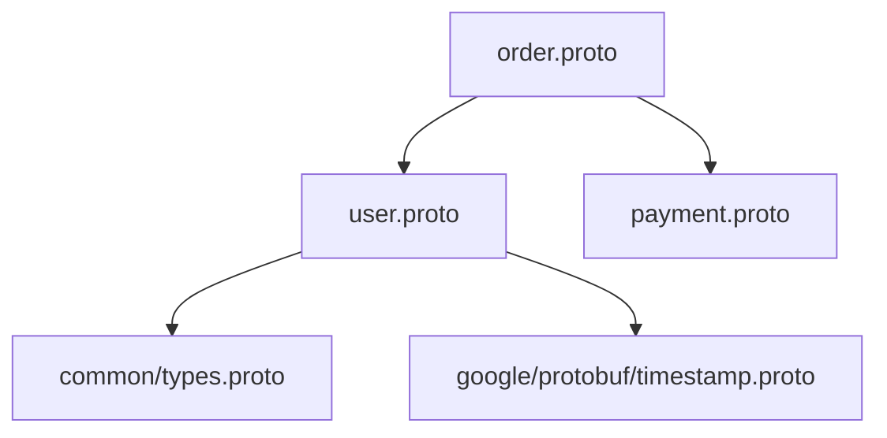

# 🦬 Buffalo Roadmap

> Статус: 📋 Планируется | 🔧 В разработке | ✅ Готово

---

## ✅ Реализовано (v2.0.0)

### buffalo.validate — Нативная система валидации полей
- PGV-inspired аннотации `[(buffalo.validate.rules)...]`
- Кодогенерация для Go, Python, C++, Rust
- 30+ типов правил (gte, lte, email, uuid, pattern и т.д.)
- Embedded proto через `go:embed`
- CLI: `buffalo validate init | rules | list-protos`

### Core функциональность
- Полный цикл сборки proto → Go, Python, C++, Rust
- Инкрементальная сборка с кэшированием
- Watch mode с debounce
- Diff сгенерированных файлов (unified, side-by-side, summary)
- Линтер proto файлов с авто-фиксом
- Диагностика окружения (doctor)
- Система плагинов (compiler, validator, transformer, hook, generator)
- Управление зависимостями (git, url, local) с lock-файлом
- Версионирование (hash, timestamp, semantic, git)
- Метрики сборки
- Пользовательские шаблоны кодогенерации

---

## 🎯 Buffalo 5.0.0 — План реализации

> 6 ключевых фич для превращения Buffalo в полноценную платформу proto-first разработки.

---

### 1. buffalo graph — Граф зависимостей и диаграммы
**Статус:** 📋 Планируется  
**Проект:** buffalo (core)

Визуализация структуры proto-проекта: зависимости между файлами, связи между messages/services, метрики coupling.

**CLI:**
```bash
# Форматы вывода
buffalo graph                              # terminal (tree)
buffalo graph --format dot --output deps.dot
buffalo graph --format mermaid --output deps.md
buffalo graph --format json --output deps.json
buffalo graph --format svg --output deps.svg
buffalo graph --format html --output graph.html  # интерактивный D3.js

# Скоупы
buffalo graph --scope file                 # зависимости между файлами
buffalo graph --scope package              # между пакетами
buffalo graph --scope message              # связи message → message
buffalo graph --scope service              # service → request/response

# Анализ
buffalo graph --file protos/user.proto     # что импортирует / кто импортирует
buffalo graph analyze --cycles             # циклические зависимости
buffalo graph analyze --orphans            # неиспользуемые файлы
buffalo graph analyze --coupling           # метрики связанности
buffalo graph stats                        # nodes, edges, depth
```

**Форматы:**

| Формат | Применение |
|--------|------------|
| `tree` | Быстрый обзор в терминале |
| `dot` | Graphviz → SVG/PNG/PDF |
| `mermaid` | README, PR, Wiki |
| `json` | CI/CD, автоматизация |
| `html` | Интерактивная визуализация |
| `plantuml` | Enterprise документация |

**Пример (mermaid):**


---

### 2. buffalo-lsp — Language Server Protocol
**Статус:** 📋 Планируется  
**Проект:** отдельный репозиторий `buffalo-lsp`

LSP-сервер для proto с глубокой интеграцией buffalo-аннотаций.

```bash
buffalo-lsp --stdio              # для VS Code, Neovim
buffalo-lsp --tcp --port 2089    # для отладки
```

**Возможности:**

| Capability | Описание |
|-----------|----------|
| `completion` | Типы, поля, buffalo-аннотации, import paths |
| `hover` | Документация, правила валидации |
| `definition` | Переход к message, enum, import |
| `references` | Где используется символ |
| `diagnostic` | Ошибки парсинга, lint, validate |
| `formatting` | Форматирование proto |
| `rename` | Rename с обновлением ссылок |
| `codeAction` | Добавить валидацию, fix lint |

**Автодополнение аннотаций:**
```protobuf
string email = 2 [(buffalo.validate.rules).string = {
  # Ctrl+Space →
  #   not_empty, min_len, max_len, pattern,
  #   email, uuid, uri, ip, hostname...
}];
```

**Code Actions:**
```
💡 Add validation: required
💡 Add validation: email format
💡 Fix: field should be snake_case
```

---

### 3. buffalo upgrade — Автоматическая миграция
**Статус:** 📋 Планируется  
**Проект:** buffalo (core)

Обновление Buffalo и миграция конфигов/аннотаций между версиями.

```bash
buffalo upgrade                  # до latest
buffalo upgrade --to 5.0.0       # до конкретной версии
buffalo upgrade --check          # показать доступные обновления
buffalo upgrade --dry-run        # что изменится
buffalo upgrade --rollback       # откатить последний upgrade
buffalo upgrade --changelog      # changelog между версиями
```

**Что мигрируется:**

| Компонент | Пример |
|-----------|--------|
| `buffalo.yaml` | Новые поля, renamed секции |
| Proto аннотации | Изменённые опции |
| Плагины | Обновление до совместимых версий |
| Lock-файл | Пересоздание `buffalo.lock` |

**Пример `--check`:**
```
🦬 Buffalo Upgrade Check

Current: 2.0.0 → Latest: 5.0.0

Migration steps:
  1. buffalo.yaml: add 'workspace' section
  2. 'versioning.strategy' → 'versioning.mode'
  3. Plugins: naming-validator 1.0 → 2.0

Run 'buffalo upgrade --to 5.0.0' to proceed.
```

---

### 4. buffalo workspace — Мультипроектные монорепо
**Статус:** 📋 Планируется  
**Проект:** buffalo (core)

Управление несколькими proto-проектами в одном репозитории.

**Конфигурация:**
```yaml
# buffalo-workspace.yaml
workspace:
  name: platform

projects:
  - name: user-service
    path: ./services/user-service
    tags: [backend, core]
    
  - name: order-service
    path: ./services/order-service
    depends_on: [user-service, common-protos]

  - name: common-protos
    path: ./shared/common-protos
    tags: [shared]

policies:
  consistent_versions: true
  shared_dependencies: true
  no_circular_deps: true
```

**CLI:**
```bash
buffalo workspace init
buffalo workspace build                        # все проекты
buffalo workspace build --project user-service
buffalo workspace build --tag backend
buffalo workspace build --affected             # затронутые изменениями
buffalo workspace build --affected --since main

buffalo workspace graph                        # граф между проектами
buffalo workspace affected --since HEAD~1      # какие проекты затронуты
buffalo workspace list
buffalo workspace validate
```

**Пример `affected`:**
```
🦬 Affected Projects (since HEAD~1)

Changed: services/user-service/protos/user.proto

Directly affected:
  📦 user-service

Transitively affected:
  📦 order-service (depends on user-service)
  📦 api-gateway (depends on user-service)

Recommended: buffalo workspace build --project user-service,order-service,api-gateway
```

---

### 5. buffalo.permissions — RBAC/ABAC аннотации
**Статус:** 📋 Планируется  
**Проект:** buffalo (core)

Декларативный контроль доступа с кодогенерацией middleware.

**Proto аннотации:**
```protobuf
import "buffalo/permissions/permissions.proto";

service UserService {
  option (buffalo.permissions.resource) = "users";

  rpc GetUser(GetUserRequest) returns (User)
    [(buffalo.permissions) = {
      action: "read",
      allow_self: true
    }];

  rpc CreateUser(CreateUserRequest) returns (User)
    [(buffalo.permissions) = {
      action: "create",
      roles: ["admin", "user_manager"],
      scopes: ["users:write"]
    }];

  rpc UpdateUser(UpdateUserRequest) returns (User)
    [(buffalo.permissions) = {
      action: "update",
      conditions: [
        {field: "user_id", operator: "eq", source: "token.sub"}
      ],
      audit_log: true
    }];

  rpc DeleteUser(DeleteUserRequest) returns (Empty)
    [(buffalo.permissions) = {
      action: "delete",
      roles: ["admin"],
      require_mfa: true,
      rate_limit: {requests: 10, window: "1h"}
    }];
}
```

**CLI:**
```bash
buffalo permissions generate --lang go
buffalo permissions generate --framework casbin
buffalo permissions generate --framework opa

buffalo permissions matrix                     # таблица ролей × методов
buffalo permissions matrix --format html
buffalo permissions audit                      # обнаружение проблем
buffalo permissions diff v1..v2                # изменения прав между версиями
```

**Пример matrix:**
```
🔐 Permissions Matrix — UserService

Method       │ admin │ user_manager │ user │ Conditions
─────────────┼───────┼──────────────┼──────┼───────────────
GetUser      │  ✅   │     ✅       │  ✅  │ allow_self
CreateUser   │  ✅   │     ✅       │  ❌  │ scope: users:write
UpdateUser   │  ✅   │     ✅       │  ⚠️  │ ABAC: user_id=token.sub
DeleteUser   │  ✅   │     ❌       │  ❌  │ MFA required
```

---

### 6. buffalo-tui — Watch с TUI diff-визуализацией
**Статус:** 📋 Планируется  
**Проект:** отдельный репозиторий `buffalo-tui`

Терминальный UI (Bubble Tea) для Buffalo: live watch, diff, навигация, логи.

```bash
buffalo-tui
buffalo-tui --config ./buffalo.yaml
buffalo-tui --theme dark
```

**Интерфейс:**
```
┌─ 🦬 Buffalo TUI ─────────────────────────────────────────────────┐
│ ┌─ Files ────────┐ ┌─ Diff: user.proto ────────────────────────┐ │
│ │ 📁 protos/     │ │  type User struct {                       │ │
│ │  ├─ ✅ user    │ │      Id    string                         │ │
│ │  ├─ ✅ order   │ │ +    Age   int32                          │ │
│ │  └─ ❌ bad     │ │ +    Phone string                         │ │
│ │                │ │  }                                        │ │
│ ├─ Stats ────────┤ │                                           │ │
│ │ Files: 4/4     │ │                                           │ │
│ │ Build: 1.2s    │ │                                           │ │
│ │ Cache: 75%     │ │                                           │ │
│ └────────────────┘ └───────────────────────────────────────────┘ │
│ ┌─ Log ────────────────────────────────────────────────────────┐ │
│ │ 14:32:05 👀 Change: protos/user.proto                        │ │
│ │ 14:32:06 ✅ Go: 2 files (0.8s)                               │ │
│ │ 14:32:06 ❌ bad.proto:15: syntax error                       │ │
│ └──────────────────────────────────────────────────────────────┘ │
│ [Tab] Panel  [d] Diff mode  [b] Build  [g] Graph  [q] Quit      │
└──────────────────────────────────────────────────────────────────┘
```

**Возможности:**
- Live watch с debounce
- Side-by-side / unified diff
- File tree со статусами (✅ ⚠️ ❌)
- Error panel с навигацией
- Build log, stats, cache hit rate
- ASCII-граф зависимостей
- Vim-like навигация

---

## 📊 Матрица — Buffalo 5.0.0

| # | Функция | Тип | Сложность | Ценность |
|---|---------|-----|-----------|----------|
| 1 | buffalo graph | core | Средняя | Высокая |
| 2 | buffalo-lsp | отд. проект | Высокая | Высокая |
| 3 | buffalo upgrade | core | Средняя | Средняя |
| 4 | buffalo workspace | core | Высокая | Высокая |
| 5 | buffalo.permissions | core | Средняя | Средняя |
| 6 | buffalo-tui | отд. проект | Средняя | Высокая |

### Порядок реализации

```
Фаза 1 (фундамент):
  ┌─────────────────┐     ┌─────────────────┐
  │  buffalo graph  │     │ buffalo upgrade │
  └───────┬─────────┘     └─────────────────┘
          │
Фаза 2 (надстройка):
          ├────────────────────┐
          ▼                    ▼
  ┌─────────────────┐  ┌──────────────────┐
  │buffalo workspace│  │buffalo.permissions│
  └───────┬─────────┘  └──────────────────┘
          │
Фаза 3 (DX):
          ├────────────────────┐
          ▼                    ▼
  ┌─────────────────┐  ┌─────────────────┐
  │   buffalo-lsp   │  │   buffalo-tui   │
  └─────────────────┘  └─────────────────┘
```

---

## 💡 Backlog (будущие версии)

### Тестирование и качество
- **buffalo.mock** — Генерация моков, фикстур, record/replay
- **buffalo migrate** — Версионирование proto, breaking changes detection
- **buffalo security** — PII detection, CVE scanning, SARIF

### Экосистема и интеграции
- **buffalo.openapi** — Proto → OpenAPI 3.1, Swagger UI
- **buffalo.db** — ORM аннотации, SQL DDL, миграции БД
- **buffalo.graphql** — Proto → GraphQL SDL, DataLoader
- **buffalo.events** — Kafka/RabbitMQ/NATS, Schema Registry

### DevOps и Cloud
- **buffalo benchmark** — gRPC load testing, latency percentiles
- **buffalo cloud** — K8s manifests, Terraform, Helm charts
- **buffalo.observability** — OpenTelemetry, Prometheus, tracing

### DX
- **buffalo repl** — Интерактивный gRPC клиент
- **buffalo convert** — proto2↔proto3, JSON Schema, OpenAPI, Avro
- **buffalo docs** — HTML/Markdown документация
- **buffalo sdk** — Готовые SDK-пакеты с README, тестами
- **buffalo registry** — Приватный реестр proto-пакетов

### Дополнительные аннотации
- `buffalo.rate_limit` — Rate limiting
- `buffalo.cache` — Кэширование ответов
- `buffalo.retry` — Политики повторов
- `buffalo.deprecation` — Управление устареванием
- `buffalo.feature_flags` — Feature flags
- `buffalo.circuit_breaker` — Circuit breaker
- `buffalo.i18n` — Интернационализация

---

*Последнее обновление: Февраль 2026*  
*Целевой релиз Buffalo 5.0.0: TBD*
